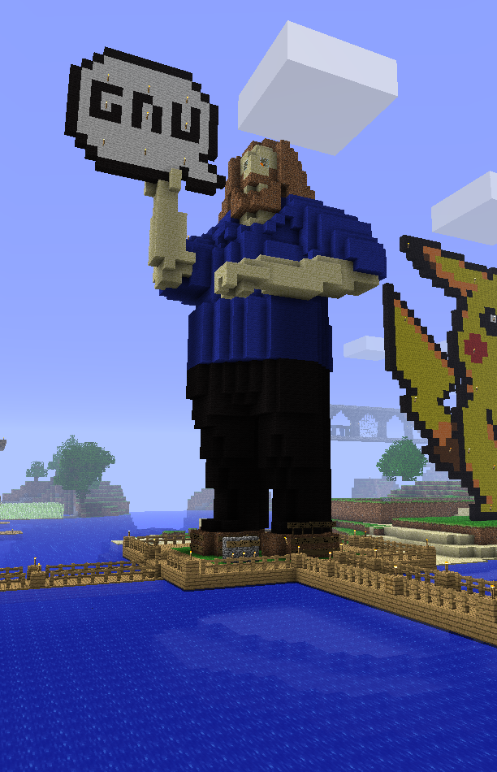

For this repo I'll accept basically any kind of prompt.

Editing is not allowed, but adding new text files is.

Just add a new `.txt` file with the raw prompt.

Not incredibly long but elaborate enough to define something fun.

New categories can be created by creating new directories.

This was the first prompt that was added: [link](https://raw.githubusercontent.com/madprops/prompts/refs/heads/main/personalities/volante.txt).

